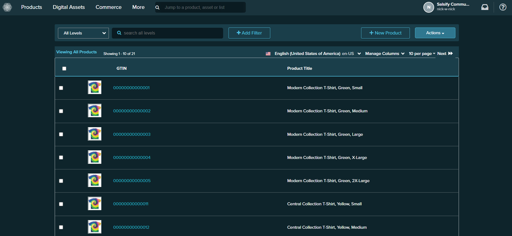

# Wiki Dark Mode

    </img>

#

## Installation

**Step 1:** Install [Stylus](https://add0n.com/stylus.html) for either [Firefox](https://addons.mozilla.org/en-US/firefox/addon/styl-us/), [Chrome](https://chrome.google.com/webstore/detail/stylus/clngdbkpkpeebahjckkjfobafhncgmne) or [Opera](https://addons.opera.com/en-gb/extensions/details/stylus/)

**Step 2:** [Install the style usercss](https://github.com/nick-w-nick/salsify-community/raw/master/categories/extensions/Salsify%20Dark%20Mode/salsify-dark-mode.user.css)